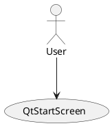
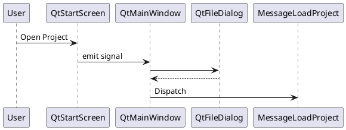
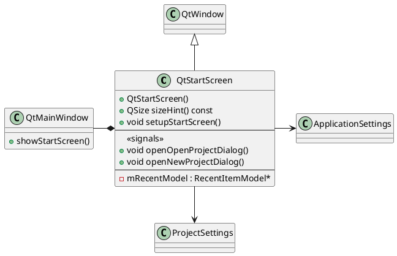

# QtStartScreen

## Idea
QtStarScreen is the welcome screen.
- It shows the logo.
- It shows the version.
- It contains a link to the home page.
- It notifies the user if a new version exists.
- It contains a new project button.
- It contains an open project button.
- It contains a list of recent project.

## Use Case

## Sequence

## Class

